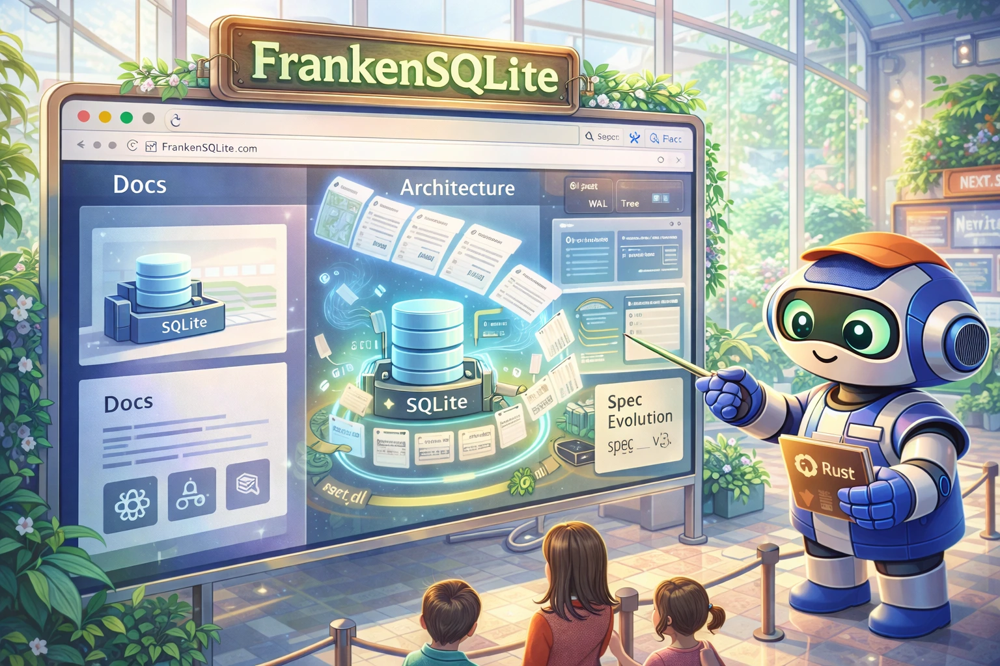

# FrankenSQLite Website

<div align="center">
  
</div>

<div align="center">

[](https://nextjs.org/)
[](https://react.dev/)
[](https://www.typescriptlang.org/)
[](https://bun.sh/)
[](https://vercel.com/)
[](#license)

</div>

This repository contains the marketing and documentation website for **FrankenSQLite**.
It mixes product pages with technical docs, visual demos, and a browser-based spec evolution viewer.

**Live site:** https://frankensqlite.com  
**Engine source:** https://github.com/Dicklesworthstone/frankensqlite

<div align="center">
<h3>Quick Install</h3>

```bash
git clone https://github.com/<you>/frankensqlite_website.git
cd frankensqlite_website
bun install
bun dev
```

<p><em>If you only want to browse, open https://frankensqlite.com.</em></p>
</div>

## TL;DR

**The Problem:** Most database project sites either explain internals poorly or treat docs as an afterthought.

**The Solution:** This site keeps product narrative and technical detail in one place, with interactive components for architecture, concurrency, durability, and spec history.

### Why This Setup Works

| Capability | Practical Benefit |
|---|---|
| **Centralized content model** | Most static content is maintained in `lib/content.tsx` |
| **Interactive docs** | Complex behavior is shown through components, not only prose |
| **Spec evolution lab** | Commit history is browsable from a SQLite file loaded in the browser |
| **Performance-aware frontend** | Heavy modules are dynamically loaded where appropriate |
| **Strict TypeScript + linting** | Safer refactors and clearer maintenance boundaries |
| **Bun-only workflow** | One package manager and one lockfile path |

## Quick Example

```bash
# 1) Install dependencies
bun install

# 2) Start local dev server (Turbopack)
bun dev

# 3) Visit key pages
#    http://localhost:3000/
#    http://localhost:3000/architecture
#    http://localhost:3000/spec_evolution

# 4) Run static checks
bun tsc --noEmit
bun lint

# 5) Build production bundle
bun run build

# 6) Optional: spec route smoke test
bun run test:e2e tests/e2e/smoke.spec.ts --grep spec_evolution --project=chromium
```

## Design Philosophy

1. **Use demonstrations for complex behavior**  
   When possible, show engine behavior directly with interactive components.

2. **Keep content in one main source file**  
   `lib/content.tsx` is the main place for static site copy and structured lists.

3. **Avoid unnecessary moving parts**  
   No CMS, minimal external runtime requirements, explicit route/component boundaries.

4. **Keep quality checks routine**  
   Type-checking, linting, and bug scanning are part of normal development.

## How It Compares

| Dimension | This Project | Generic Static Docs Site | Typical Marketing Landing Page |
|---|---|---|---|
| Technical depth | ✅ High | ⚠️ Medium/Low | ⚠️ Low |
| Interactivity | ✅ High | ❌ Low | ⚠️ Medium |
| Data-backed history viewer | ✅ Yes | ❌ Rare | ❌ No |
| Content editing model | ✅ TS-based | ⚠️ Often split across many files | ⚠️ Often CMS-based |
| Runtime complexity | ⚠️ Moderate in spec viewer | ✅ Low | ✅ Low |
| Best use case | Product + technical docs for complex systems | Reference docs | Top-of-funnel marketing |

## Tech Stack

| Layer | Technology |
|---|---|
| Framework | Next.js 16 (App Router) |
| UI | React 19, TypeScript (strict) |
| Styling | Tailwind CSS 4 |
| Motion | framer-motion |
| Charts | echarts |
| In-browser DB | sql.js |
| Diff rendering | diff2html |
| Markdown parsing/sanitize | marked + dompurify |
| Data state (spec lab) | TanStack Query + Store + Table + Virtual |
| Package manager | **bun only** |
| Deployment | Vercel |

## Routes

| Route | Rendering | Purpose |
|---|---|---|
| `/` | Client | Main product and architecture narrative |
| `/architecture` | Server | Layered architecture deep dive |
| `/getting-started` | Server | Install + quickstart + FAQ |
| `/showcase` | Server | Screenshot gallery |
| `/spec_evolution` | Server shell + client viewer | Fullscreen spec evolution lab |

## Installation

### Option 1: Clone Repository

```bash
git clone https://github.com/<you>/<repo>.git
cd <repo>
bun install
```

### Option 2: Tarball via `curl`

```bash
export REPO_OWNER="<your-github-username-or-org>"
export REPO_NAME="<this-repo-name>"
curl -fsSL "https://codeload.github.com/${REPO_OWNER}/${REPO_NAME}/tar.gz/refs/heads/main" \
  | tar -xz
cd "${REPO_NAME}-main"
bun install
```

### Option 3: Existing Local Checkout

```bash
cd /path/to/frankensqlite_website
bun install
```

## Quick Start

1. Install dependencies:
   ```bash
   bun install
   ```
2. Start development server:
   ```bash
   bun dev
   ```
3. Open `http://localhost:3000`.
4. Run checks before pushing:
   ```bash
   bun tsc --noEmit
   bun lint
   bun run build
   ```

## Command Reference

### Bun Scripts

| Command | Purpose |
|---|---|
| `bun dev` | Start Next.js dev server with Turbopack |
| `bun run build` | Build production bundle |
| `bun start` | Run production server |
| `bun lint` | Run ESLint |
| `bun tsc --noEmit` | Type-check without emit |
| `bun test` | Run unit tests (Vitest) |
| `bun run test:e2e` | Run Playwright E2E suite |
| `bun run analyze` | Build with bundle analyzer flag |

### Issue Tracking (`br`)

| Command | Purpose |
|---|---|
| `br ready --json` | List unblocked issues |
| `br create "Title" -t task -p 2 --json` | Create issue |
| `br update br-42 --status in_progress --json` | Mark work in progress |
| `br close br-42 --reason "Done"` | Close completed issue |
| `br sync --flush-only` | Export issue state to `.beads/` |

### Bug Scanner (`ubs`)

| Command | Purpose |
|---|---|
| `ubs --staged` | Scan staged changes |
| `ubs --only=js components/spec-evolution` | Scan spec-evolution frontend scope |
| `ubs .` | Full project scan |

## Configuration

### Primary Config Files

| File | Purpose |
|---|---|
| `next.config.ts` | Next.js configuration |
| `tsconfig.json` | TypeScript settings |
| `eslint.config.mjs` | ESLint flat config |
| `postcss.config.mjs` | Tailwind/PostCSS setup |
| `lib/content.tsx` | Main static site content source |

### Environment Variables

Core functionality has no required external API environment variables.

Example `.env.local`:

```bash
# Optional local-only values
# Do not commit this file
```

## Architecture

```text
┌──────────────────────────────────────────────────────────────────────────┐
│                               Next.js App Router                        │
│  /, /architecture, /getting-started, /showcase, /spec_evolution         │
└──────────────────────────────────────────────────────────────────────────┘
                  │
                  ▼
┌──────────────────────────────────────────────────────────────────────────┐
│                            Client Shell Layer                           │
│  SiteProvider + Header/Footer + Cursor/HUD + transitions               │
│  (spec_evolution route uses fullscreen minimal shell)                   │
└──────────────────────────────────────────────────────────────────────────┘
                  │
        ┌─────────┴─────────┐
        ▼                   ▼
┌───────────────────┐   ┌──────────────────────────────────────────────────┐
│ Content System    │   │ Spec Evolution Subsystem                         │
│ lib/content.tsx   │   │ viewer.tsx + TanStack Query/Store/Table/Virtual │
│ Static copy/data  │   │ sql.js + diff2html + echarts + patch engine      │
└───────────────────┘   └──────────────────────────────────────────────────┘
        │                   │
        ▼                   ▼
┌───────────────────┐   ┌──────────────────────────────────────────────────┐
│ UI Components     │   │ Local DB Asset                                   │
│ cards, tables,    │   │ public/spec_evolution_v1.sqlite3                │
│ timelines, viz    │   │ Loaded client-side in browser                    │
└───────────────────┘   └──────────────────────────────────────────────────┘
```

## Development Workflow

1. Pick work from `br ready`.
2. Implement changes.
3. Run checks:
   ```bash
   bun tsc --noEmit
   bun lint
   ubs --staged
   ```
4. Sync issue state:
   ```bash
   br sync --flush-only
   ```
5. Commit code and `.beads/` together.

## Troubleshooting

### `bun: command not found`

Install Bun first:

```bash
curl -fsSL https://bun.sh/install | bash
exec "$SHELL"
```

### `INIT_FAILURE` on `/spec_evolution`

Common causes:
- `public/spec_evolution_v1.sqlite3` is missing or corrupted
- browser blocked WASM/network loading

Quick checks:

```bash
ls -lh public/spec_evolution_v1.sqlite3
bun dev
```

### `bun lint` reports large volumes of `.next_trash*` errors

Generated artifacts may be getting linted. Run lint on source files directly while investigating:

```bash
bun lint components/spec-evolution/viewer.tsx components/spec-evolution/viewer-loader.tsx
```

### Playwright error: missing browser binaries

Install required browsers:

```bash
bunx playwright install
```

### Next.js warning about multiple lockfiles/root detection

Set `turbopack.root` in `next.config.ts` or remove unrelated lockfiles in parent directories.

## Limitations

### What This Project Does Not Do

- No CMS-backed content authoring UI
- No built-in auth or account system
- No current i18n/localized route support
- Bun-only package management by project policy

### Known Constraints

| Capability | Current State | Notes |
|---|---|---|
| Live backend APIs | ❌ Not used for core site | Site is mostly static + client-side interactive modules |
| Content authoring UI | ❌ Not supported | Edit TS content directly |
| Fully SSR spec viewer | ⚠️ Partial | Viewer is client-heavy by design |

## FAQ

### Is this a personal portfolio site?

No. It is a product marketing and documentation site for FrankenSQLite.

### Where should I edit static site copy?

`lib/content.tsx` is the main source for static copy and structured content.

### Why is `/spec_evolution` special?

It loads a SQLite database in-browser, reconstructs snapshots, renders diffs, and visualizes changes over time.

### Which package manager is supported?

Only **Bun** (`bun install`, `bun dev`, etc.). Do not use npm, yarn, or pnpm.

### What checks should I run before push?

```bash
bun tsc --noEmit
bun lint
bun run build
ubs --staged
```

### Do I need environment variables?

Usually no, for core local development. If needed, use `.env.local` and do not commit it.

## About Contributions

> *About Contributions:* Please don't take this the wrong way, but I do not accept outside contributions for any of my projects. I simply don't have the mental bandwidth to review anything, and it's my name on the thing, so I'm responsible for any problems it causes; thus, the risk-reward is highly asymmetric from my perspective. I'd also have to worry about other "stakeholders," which seems unwise for tools I mostly make for myself for free. Feel free to submit issues, and even PRs if you want to illustrate a proposed fix, but know I won't merge them directly. Instead, I'll have Claude or Codex review submissions via `gh` and independently decide whether and how to address them. Bug reports in particular are welcome. Sorry if this offends, but I want to avoid wasted time and hurt feelings. I understand this isn't in sync with the prevailing open-source ethos that seeks community contributions, but it's the only way I can move at this velocity and keep my sanity.

## License

No explicit license file is currently included in this repository snapshot. Unless or until a license is added by the project owner, default copyright protections apply.
